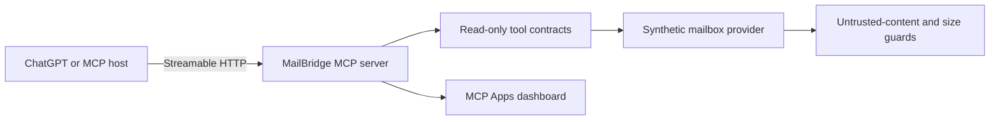

# MailBridge MCP

[](https://github.com/gexiro-global/mailbridge-mcp/actions/workflows/ci.yml)
[](https://github.com/gexiro-global/mailbridge-mcp/actions/workflows/codeql.yml)
[](LICENSE)

**Security-first, read-only email intelligence for MCP-compatible AI assistants.**

MailBridge demonstrates how an AI assistant can search multiple mailboxes,
reconstruct threads, inspect attachments, and preserve mailbox state. The
public distribution runs entirely on synthetic data, so it is safe to explore
without credentials or access to a real inbox.

> This repository is a controlled public reference distribution by Gexiro
> Global Enterprises Ltd. It is not a mirror of any private deployment and
> contains no production configuration, infrastructure, mailbox data, or
> credentials.

## Why MailBridge

- Eleven deliberately read-only MCP tools.
- Standard `search` and `fetch` contracts for knowledge-source compatibility.
- MCP Apps widget with a versioned `ui://` resource.
- Multi-mailbox and all-folder search behavior.
- Thread reconstruction using `Message-ID`, `In-Reply-To`, and `References`.
- Bounded attachment retrieval with SHA-256 checksums.
- Explicit warning that email and attachment content is untrusted.
- Fail-closed public binding: loopback-only unless an operator explicitly opts in.
- Zero SMTP, send, move, delete, flag, append, copy, or expunge operations.

## Tool surface

| Tool | Purpose |
| --- | --- |
| `list_mailboxes` | Discover synthetic mailboxes and safe metadata. |
| `mailbox_health` | Report redacted TLS/auth/folder/read-only health. |
| `list_folders` | Enumerate selectable folders and counters. |
| `list_recent_messages` | Return bounded recent message metadata. |
| `search_messages` | Structured multi-mailbox, all-folder search. |
| `fetch_message` | Fetch one bounded message without changing unread state. |
| `fetch_thread` | Reconstruct a thread from message identifiers. |
| `list_attachments` | Return attachment metadata only. |
| `fetch_attachment` | Return bounded synthetic bytes, base64, and SHA-256. |
| `search` | Standard read-only knowledge search. |
| `fetch` | Standard read-only knowledge document fetch. |

Every descriptor sets `readOnlyHint: true`, `destructiveHint: false`,
`idempotentHint: true`, and `openWorldHint: false`.

## Quick start

Requirements: Node.js 24 or newer.

```bash
npm ci
npm run check
npm run dev
```

The server starts on loopback by default:

```text
Health: http://127.0.0.1:3100/health
Widget: http://127.0.0.1:3100/widget
MCP:    http://127.0.0.1:3100/mcp
```

To connect from an MCP client, use the streamable HTTP endpoint `/mcp`. For
ChatGPT developer testing, expose the loopback service through a reviewed HTTPS
tunnel and refresh the app after tool or resource metadata changes.

## Architecture



The provider boundary is intentionally small. This public edition ships only
the synthetic provider; production adapters, operator identities, credential
storage, and deployment topology are outside this repository.

## Security properties

- No credential input exists in any MCP tool schema.
- No real mailbox connection is implemented in this public distribution.
- Message fetches do not mutate synthetic unread state.
- Attachment bytes are bounded and labeled as untrusted.
- The HTTP runtime refuses non-loopback binding unless the explicit synthetic
  demo acknowledgement is set.
- CI runs compilation, tests, repository secret scanning, dependency audit,
  dependency review, and CodeQL.

See [SECURITY.md](SECURITY.md) and [ARCHITECTURE.md](ARCHITECTURE.md).

## OpenAI Apps SDK alignment

The implementation follows the current MCP Apps-first guidance:

- the UI resource uses `text/html;profile=mcp-app`;
- tools remain useful without the widget;
- `list_mailboxes` points to a versioned `_meta.ui.resourceUri`;
- the widget consumes `ui/notifications/tool-result` and uses
  `window.openai.toolOutput` only as a compatibility path;
- CSP metadata declares no external connect or resource domains.

Official references:

- [Build an MCP server](https://developers.openai.com/apps-sdk/build/mcp-server)
- [Add UI to your MCP server](https://developers.openai.com/apps-sdk/build/chatgpt-ui)
- [Define tools](https://developers.openai.com/apps-sdk/plan/tools)
- [Apps SDK reference](https://developers.openai.com/apps-sdk/reference)

## License

Apache License 2.0. Copyright © 2026 Gexiro Global Enterprises Ltd.
