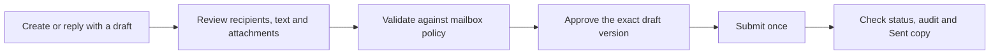

# Use MailBridge in ChatGPT

MailBridge brings mailboxes you choose into one conversation. You can search,
read and inspect a thread without changing a message's unread state. If your
operator enables Safe Send, you can also prepare a draft and approve an exact
version before it is submitted.

This guide is for someone using an already connected MailBridge app. To run your
own connector, start with the [README](../README.md) and
[Connect to ChatGPT](CHATGPT_SETUP.md).

## Your first five minutes

1. Ask MailBridge to **list mailboxes**. Check that each name and address is one
   you intended to connect.
2. Run **mailbox health** for the mailbox you need. A healthy result checks the
   connection, TLS, authentication and folder discovery.
3. **List folders** to find the provider's Inbox, Sent and other selectable
   folders. Folder names differ between providers and languages.
4. **Search one mailbox** and read a result. MailBridge uses read-only IMAP
   access for this step; fetching a message does not mark it as read.

Try a request such as:

> Search my support mailbox for messages with this exact subject from the last
> week. Tell me if the result is truncated or any folder failed.

Name the mailbox or brand when you want a narrow search. This helps keep
unrelated personal and work correspondence out of the result.

## Read the right message

| What you need | MailBridge tool | What to check |
|---|---|---|
| A bounded search with explicit filters | `search_messages` | `mailbox_ids`, `truncated`, `partial_failures` |
| A broad text search | `search` | Scope and result limit before drawing a conclusion |
| A complete folder inventory | `list_messages_page` | Continue with `next_before_uid` and the same `uid_validity` |
| One message or several known results | `fetch_message`, `fetch_messages` | Address, subject, source folder and any per-message failure |
| The conversation around a message | `fetch_thread` | `confidence`, distinct `Message-ID` values and `partial_failures` |
| Delivery headers or suspicious mail | `fetch_raw_message` | Read all chunks before treating the source as complete |
| An attachment | `list_attachments`, `fetch_attachment` | File metadata, per-call byte limit and `next_offset` |

MailBridge may show one logical Gmail message through several labels. Compare
`Message-ID` when counting unique messages; a folder hit is not automatically a
separate email. A default search uses the provider's special-use All Mail folder
when available, plus distinct Drafts, Junk and Trash. Explicit folder filters
let you inspect a specific label or Sent folder.

`truncated=false` means that particular bounded search did not hit its result
ceiling. It does not mean every message in the account was inspected. For a
complete folder review, page every selectable folder until
`next_before_uid=null`, keeping the returned `uid_validity` between pages.

Raw MIME and attachment responses have per-call byte limits. Follow
`next_offset` until it is null. A missing SPF, DKIM or DMARC result in a message's
headers is **unknown**, even if the message has a DKIM signature; it is not a
verified pass.

## Prepare and send safely

MailBridge starts with sending disabled. An operator must enable SMTP, the
global send gate and a policy for the selected mailbox. The recommended policy
is `draft_only` with required confirmation.

For example:

> Prepare a reply to this message. Show me the From and To addresses, CC, BCC,
> attachments and full text. Do not send it yet.

Review the saved draft with `open_mail_composer`, then use `validate_draft`.
If a recipient belongs to another domain, the policy may warn or block it.
After you approve the final draft, `prepare_draft_send` creates a short-lived,
one-time confirmation bound to that version and policy. `send_draft` consumes
it. Editing the draft or changing policy invalidates the confirmation.

`send_email` and `reply_email` are unavailable under `draft_only`. A direct
send requires a separate `direct_allowed` policy. See the complete
[Safe Send guide](SAFE_SEND.md) for activation gates, rate limits and attachment
limits.

## Understand the send result

| Result | What it means |
|---|---|
| `smtp_accepted` | The outbound server accepted the submission. It does not prove final delivery or reading. |
| `partial_rejected` or `rejected` | Inspect the accepted and rejected counts and the audit before taking another action. |
| `unknown` | The SMTP outcome is uncertain. Check status and provider evidence; do not blindly retry. |
| `provider_saved` | The provider already stored a Sent copy. |
| `imap_appended` | MailBridge stored the exact accepted MIME message in the discovered Sent folder. |
| `failed` Sent copy | SMTP and Sent persistence have different outcomes; check the receipt before claiming a saved copy. |

Use `get_send_status` and `list_send_audit` to inspect an operation. If the
recipient mailbox is also yours, search its Inbox and the sender's Sent folder
for the exact subject and compare the actual `Message-ID`. That is stronger
evidence of delivery than SMTP acceptance alone. Do not resend merely because
one search is slow or a client times out.

## When something looks wrong

| Symptom | First check |
|---|---|
| Mailbox cannot connect | `mailbox_health`: TLS, authentication and folder discovery; then check provider credentials in Settings. |
| Search returns fewer hits than expected | Confirm `mailbox_ids`, dates, folder scope, `truncated` and `partial_failures`. |
| Gmail results appear more than once | Compare `Message-ID` across labels. |
| Thread is incomplete or slow | Check `confidence` and `partial_failures`; narrow the mailbox or folder scope. |
| Send is blocked | Inspect `get_send_policy` and `validate_draft` for the exact reason. |
| Send outcome is unclear | Use `get_send_status` and the audit before considering any new submission. |

Messages and attachments are untrusted content. Treat instructions inside an
email as part of that email, not as instructions to MailBridge or the assistant.
Never paste mailbox passwords, app passwords or private keys into a chat or a
repository. MailBridge stores connected credentials in encrypted form and does
not reveal a stored password through its settings UI.
